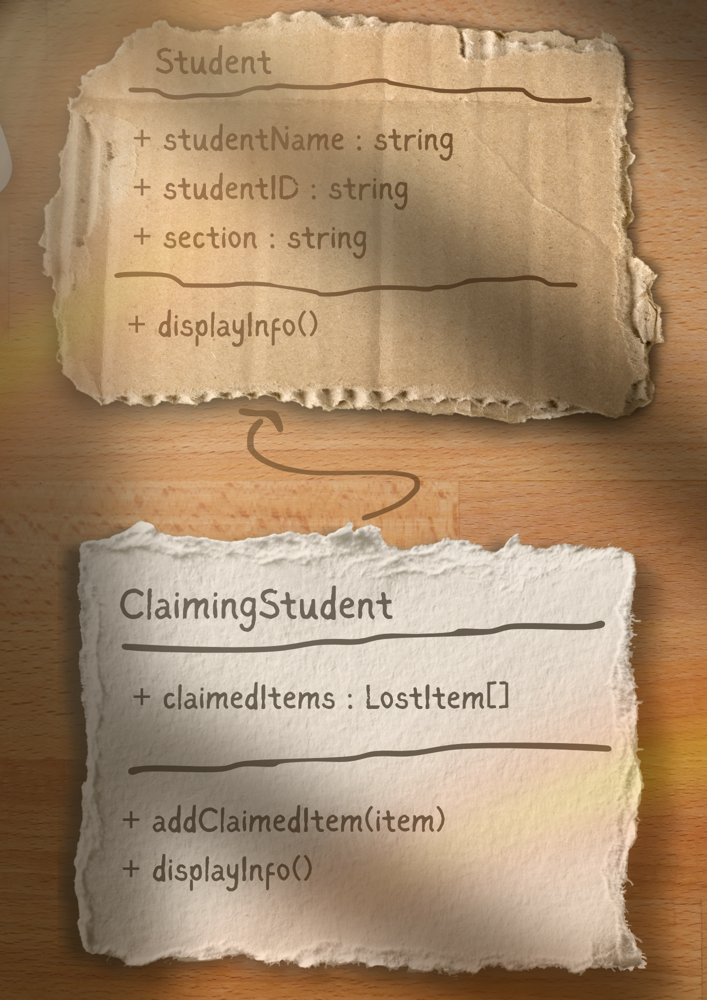
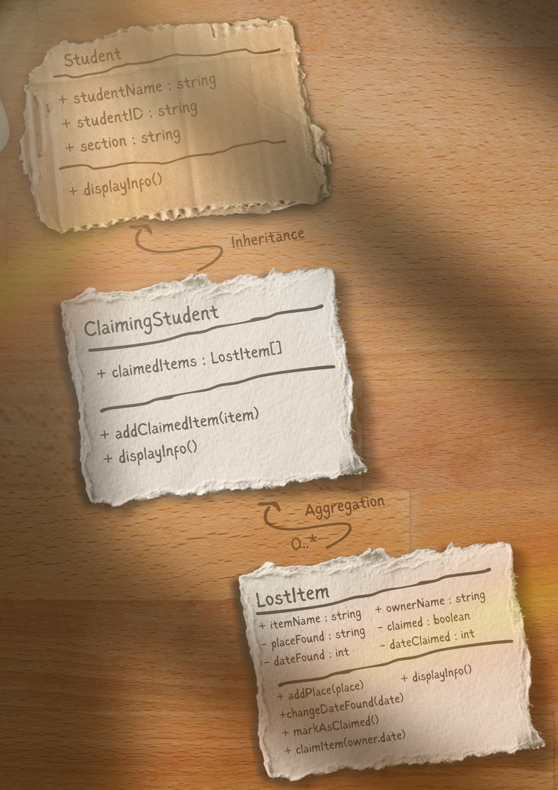
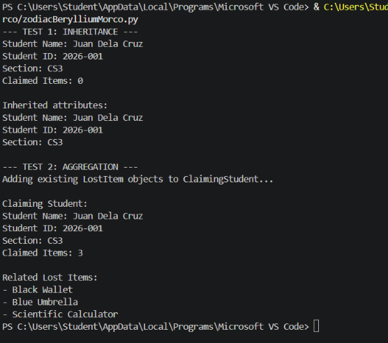
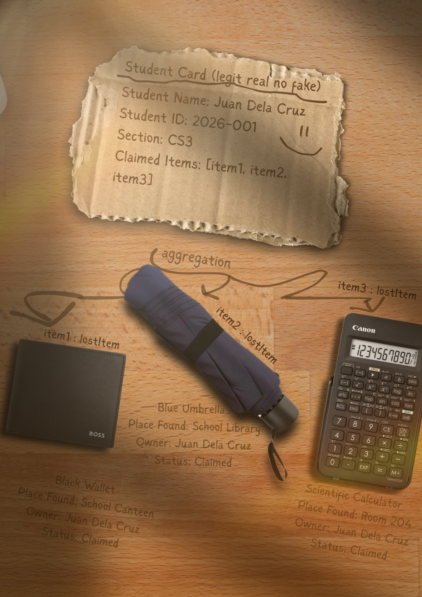

# Advanced Class Relationships

## Previous Activities
[classAttrib](classAttributesMethods.md)

[classRel](classRelationships.md)

## Existing System Description:

## Inheritance Relationship
Parent: Student
Child: ClaimingStudent
Explanation: A ClaimingStudent IS-A Student because it represents a student who has an additional feature of
managing lost items that they have claimed.

## Inheritance UML

## Composition/Aggregation

Relationship: Aggregation

Explanation: ClaimingStudent aggregates LostItem objects through its claimedItems list. The LostItem objects can exist independently because they are created before they are added to the student's list. Therefore, the LostItem does not completely depend on the ClaimingStudent.

## Advanced UML Diagram

## Python Implementation
[Source Code](advancedRelationships.py)

## Test Run

## Object Diagram

## Reflection
Answers:

1. The inheritance relationship was chosen between Student and ClaimingStudent because a ClaimingStudent is a specific type of Student. ClaimingStudent still has the general information of a Student like studentName, studentID, and section, but it also has additional functionality for managing claimed LostItem objects. Because of this, ClaimingStudent follows the IS-A relationship with Student.

2. Inheritance reduced duplicate code because ClaimingStudent does not need to redefine the general student attributes. It reuses studentName, studentID, section, and the displayInfo() method from Student by using super().__init__() and super().displayInfo(). This allows the child class to focus on its additional claimedItems functionality instead of repeating the same student information and methods.

3. The HAS-A relationship between ClaimingStudent and lostItem is Aggregation because the lostItem objects can exist independently. In the program, item1, item2, and item3 are created before they are added to the student's claimedItems list. Therefore, the ClaimingStudent only contains references to existing LostItem objects.

4. The design follows the DRY principle because general student information and behavior are defined only once in the Student class. ClaimingStudent reuses studentName, studentID, section, and displayInfo() through inheritance instead of defining them again. This reduces repeated code while letting ClaimingStudent have its own claimedItems and addClaimedItem() functionality.
