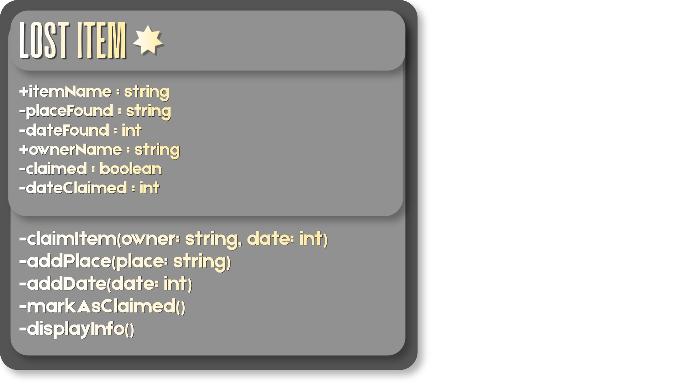
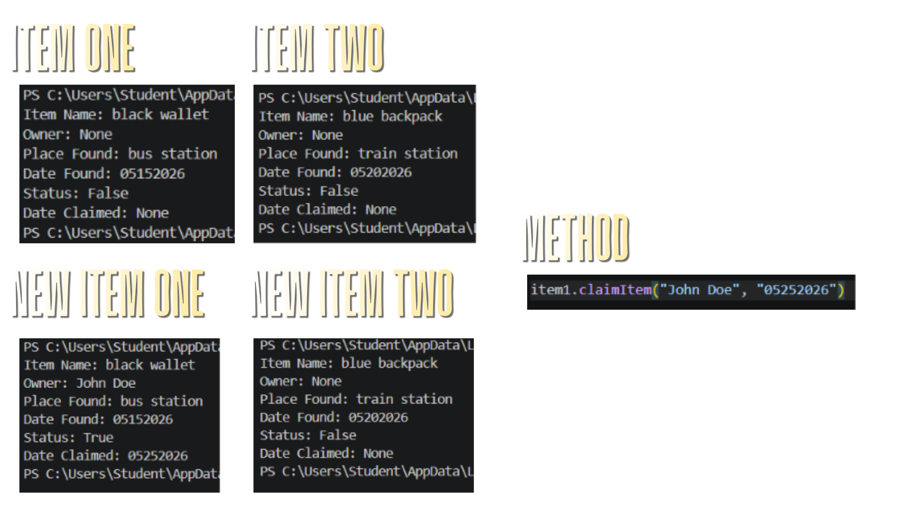
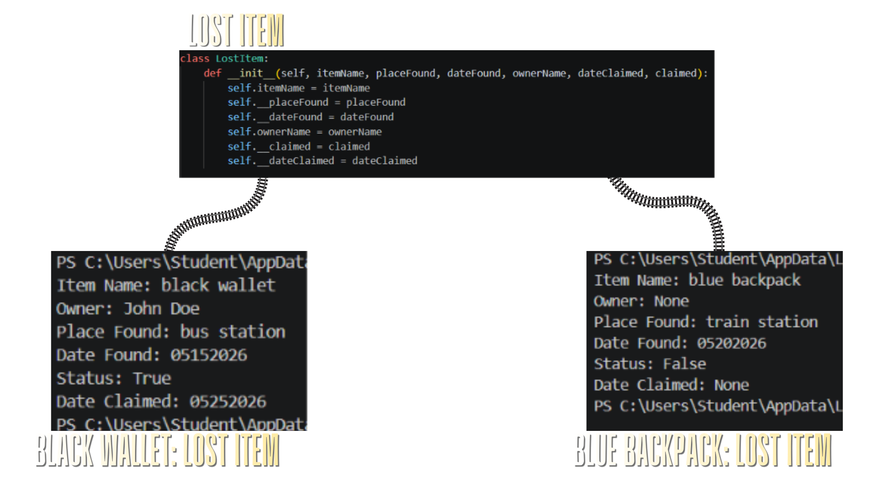

# Class Attributes and Methods
## Previous Design
Link to my previous activity:
[classObjectUML.md](https://github.com/rdpmorc/9berylliumcs3-Morco/blob/64835d368472480e9eda46a0e5111beb1cc8d124/quarter_one/classObjectUML.md)

## Design Revision
Changes in my previous design:
Added new properties and methods to the class object, dateFound, dateClaimed, and addDate(date: int).
Revised class object diagram.

## Visibility Decisions
| Attribute | Data Type | Visibility |                    Reason                    |
|-----------|-----------|------------|----------------------------------------------|
|itemName   |string     |Public      |It shows the students the lost item.          |
|placeFound |string     |Public      |It shows the students where the item was found. |
|ownerName  |string     |Public      |It keeps the owner of the item private, only visible to the school. |
|dateFound  |int        |Private     |It shows the students when the item was found. |
|claimed    |boolean    |Private     |It shows the school whether the item has been claimed or not. |
|dateClaimed|int        |Private     |It shows the school when the item has been claimed. |

## Updated UML Class Diagram

## Python Implementation
[View Python Source](https://github.com/rdpmorc/9berylliumcs3-Morco/blob/9bdf6d3b7029b81c29bc7a4cb43ec9ebec175aa1/quarter_one/classImplementation.py)

## Test Run

## Object Diagram

## Analysis
### Why did you make your chosen attribute private?
- Because these attributes can only be used in the context of this class, and would make no sense to be used otherwise, such as the dateFound or the claimed attribute.
### Which method changes the state of your object?
- The claimItem(self, owner, date) method. It changes the status of the lost item and marks it as True when it has been claimed.
### How did your two objects demonstrate that instances are independent?
- As John Doe claimed his black wallet, the blue backpack did not get marked as claimed, showing that although they are from the same class, their attributes are independent.
### What is the difference between your class diagram and your object diagram?
- The class diagram shows the methods, properties, acting as the blueprint for the objects in the class. The object diagram shows the unique attributes each object has in the class.
