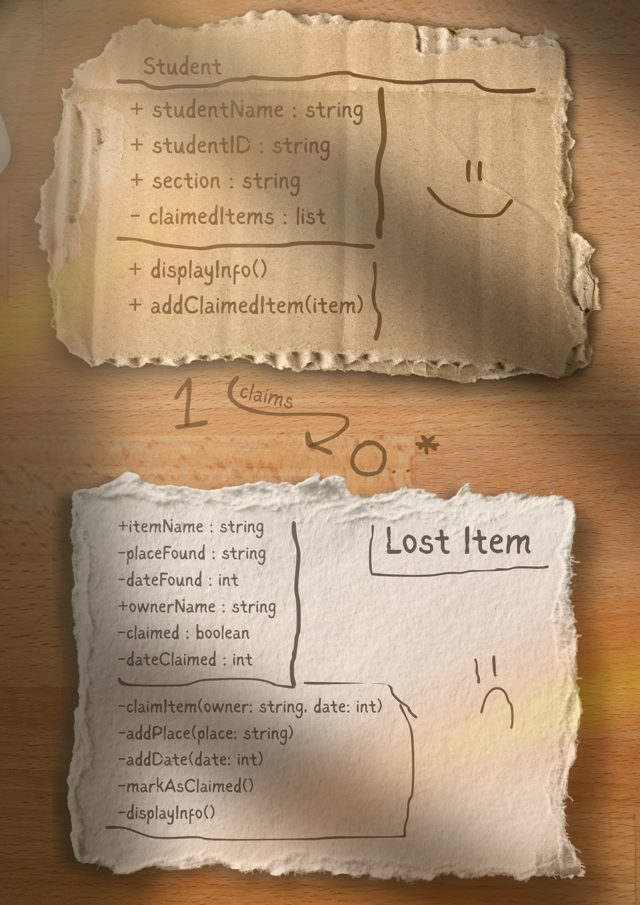
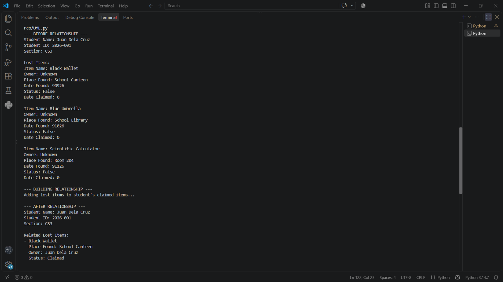
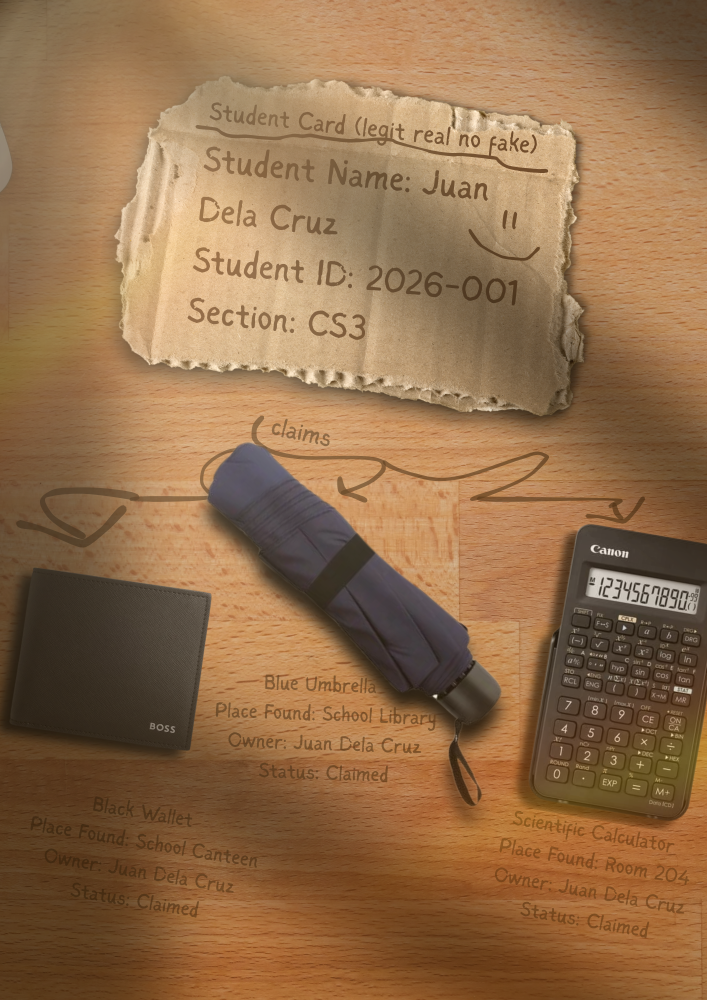

# Class Relationships: Association and Multiplicity
## Previous Work
[Part I - Classes and Objects](classObjectUML.md)

[Part II - Class Attributes and Methods](classAttributesMethods.md)

## Existing Class
Class: Lost Item

Description: The LostItem class represents an item found within the school campus. It stores information such as the item's name, where and when it was found, its owner, and whether it has already been claimed.

## New Related Class
Class: Student

Description: The Student class represents a student who may claim one or more lost items. It stores the student's name, student ID, and section, and it can display the student's information.

## Association
Relationship: Student HAS-A / claims Lost Item.

Explanation: A Student can be associated with lost items that they have claimed.

## Multiplicity
Multiplicity: Student 1 ───────── 0..* lostItem

Explanation: One student can claim zero or more lost items.

## UML Class Relationship Diagram

## Python Implementation
[View Python Source](classRelationships.py)
## Test Run

## Object Relationship Diagram

## Analysis

### What is the association between your two classes?
- The association is between the Student and LostItem classes, where a student can claim lost items. The Student object keeps references to the LostItem objects that they have claimed. This is an important connection because the purpose of the Lost Item system is to help return belongings to their owners.
  
### What multiplicity did you choose and why?
- I chose a 1 : 0..* multiplicity because one student can claim zero or more lost items. A student may not have claimed any item yet, but they could claim multiple items if they lost several belongings.
  
### How did you implement the relationship in Python?
- I implemented the relationship using the claimedItems list inside the Student class. The addClaimedItem() method adds an actual LostItem object to this list. This allows the student to keep track of multiple lost items.
  
### Why did you store an object reference instead of copying its data?
- I stored an object reference so the student can access the complete LostItem object and its properties. For example, student1.claimedItems[0].itemName accesses the itemName of the actual lost-item object. This is done to avoid duplicating the item's information.
  
### If your relationship uses many, why is a list appropriate?
- A list is appropriate because one student can be connected to multiple lost items. The claimedItems list contains actual LostItem objects, not just their names or IDs. This allows the program to loop through all of the student's claimed items and access their information.
  
